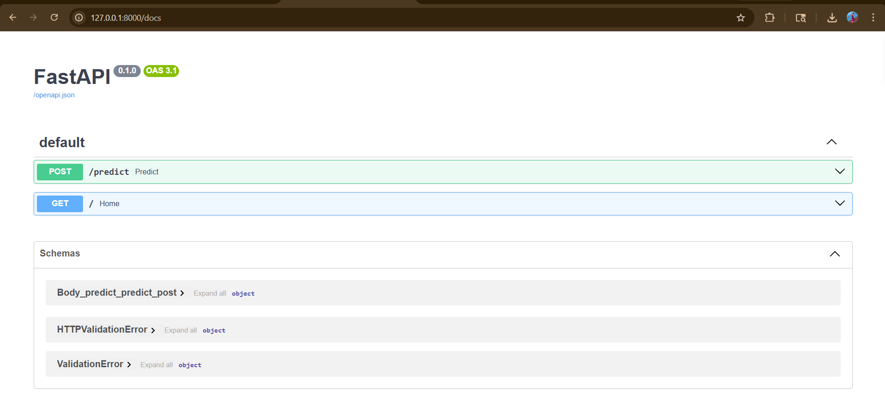
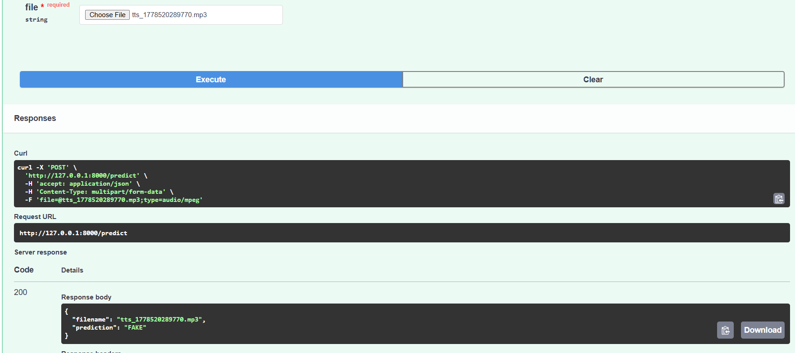

# VoiceGuard-AI 🎙️

AI-powered Deepfake Voice Detection System using FastAPI and Machine Learning.

---

## Features

- Audio Upload API
- Deepfake Voice Detection
- MFCC Feature Extraction
- RandomForest ML Model
- Drift Detection Dashboard
- GitHub Actions CI/CD
- FastAPI Swagger Documentation

---

## Tech Stack

- Python
- FastAPI
- Scikit-learn
- Librosa
- Pandas
- Evidently AI
- GitHub Actions

---

## Project Structure

```bash
VoiceGuard-AI/
│
├── app/
│   ├── api/
│   ├── features/
│   └── services/
│
├── data/
│   ├── raw/
│   │   ├── real/
│   │   └── fake/
│   └── dataset.csv
│
├── models/
│   └── deepfake_detector.pkl
│
├── scripts/
│   ├── build_dataset.py
│   ├── train_model.py
│   └── detect_drift.py
│
├── dashboards/
│   └── drift_report.html
│
├── .github/
│   └── workflows/
│       └── ci.yml
│
├── requirements.txt
├── main.py
└── README.md
```

---

## Swagger API

Add your Swagger UI screenshot below:

```md

```

---

## Prediction Example

Add your prediction response screenshot below:

```md

```

---

## Streamlit Frontend 🌐

Run Streamlit UI:

```bash
streamlit run streamlit_app.py
```

This provides:
- audio upload interface
- prediction display
- simple web application frontend

---
Docker Container Setup
Build the Docker image:

docker build -t voiceguard-ai .

Run the container:

docker run -p 8000:8000 voiceguard-ai

Access the API:

http://localhost:8000/docs

---

## Run Locally

```bash
pip install -r requirements.txt
```

```bash
uvicorn main:app --reload
```

Open Swagger Docs:

```bash
http://127.0.0.1:8000/docs
```

---

## Model Training

```bash
python -m scripts.build_dataset
```

```bash
python -m scripts.train_model
```

---

## Drift Detection

```bash
python -m scripts.detect_drift
```

Generated dashboard:

```bash
dashboards/drift_report.html
```

---

## CI/CD Pipeline

GitHub Actions automatically:

- Installs dependencies
- Verifies project setup
- Runs CI workflow on push

---

## Sample API Response

```json
{
  "filename": "sample.mp3",
  "prediction": "FAKE"
}
```

---

## Future Improvements

- Wav2Vec2 Deep Learning Model
- Streamlit Frontend
- Docker Deployment
- Kubernetes Deployment
- Real-time Audio Detection

---

## Author

Chandana Reddy

---